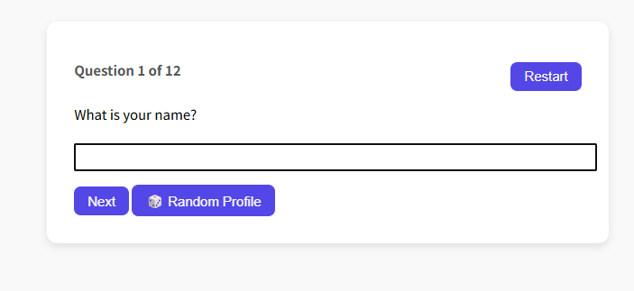
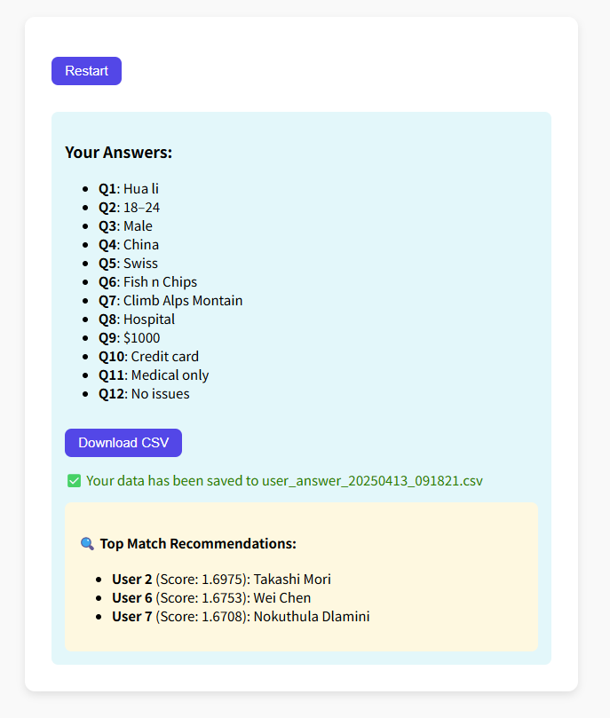
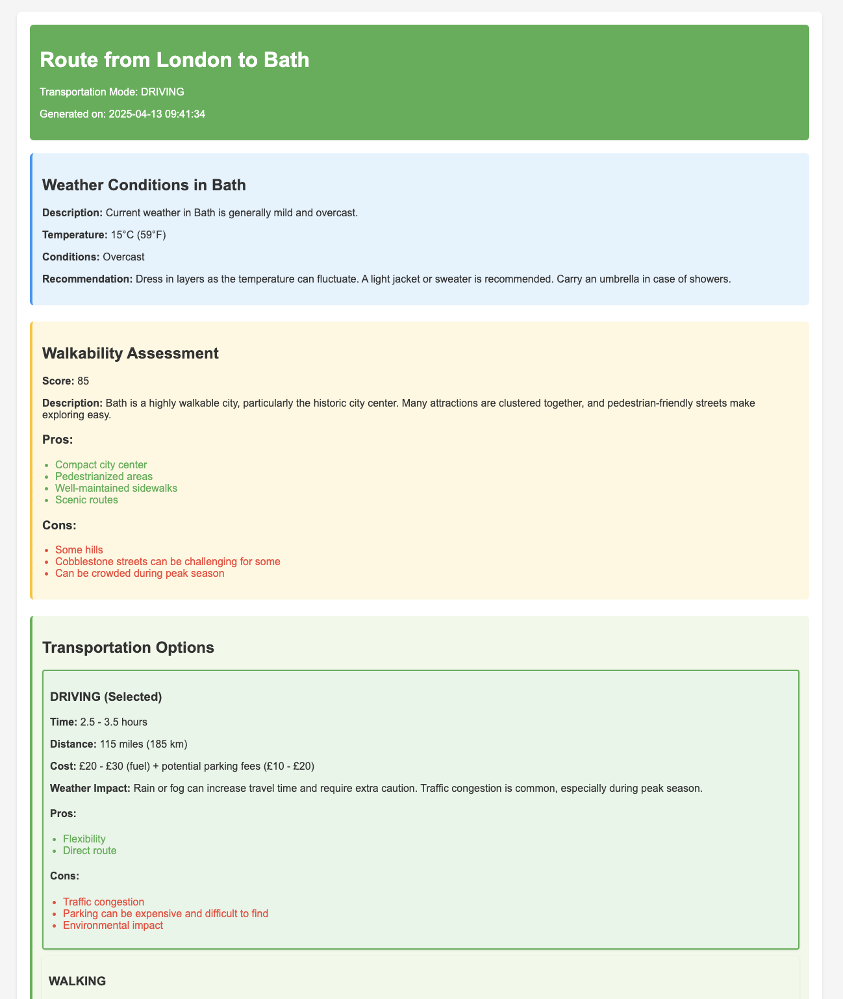

# ✈️ Project Name: **WanderMatch**


## 📌 Summary

**WanderMatch** is a travel matchmaking and recommendation platform designed for adventure-seekers looking to connect with like-minded travelers. Our app lets users fill out a simple form with their travel preferences, matches them with a potential travel partner, recommends an optimized travel route based on their combined preferences, and finally generates a shareable content piece for their social media.

Built during Encode London AI Hackathon, WanderMatch aims to streamline travel planning while fostering meaningful connections.

## 📖 Overview

The application workflow consists of three core features:

1. **Travel Mate Recommendation**  
   Based on a user's submitted preferences (destination type, travel budget, preferred activities, etc.), the system identifies and recommends a compatible travel partner.

2. **Route Recommendation**  
   Once paired, WanderMatch proposes an optimized travel route tailored to the duo's shared interests and constraints.

3. **Social Media Content Generation**  
   Finally, the app auto-generates a personalized travel content piece — a blog post or social media caption — summarizing their travel plan, destinations, and highlights.


## 🛠️ How Sponsor Tech Was Used

**Portia's Plan** feature empowers users to review the agent’s behavior before execution, providing transparency and control over the trip-making process. Users are now able to make informed decisions about what information to share and which tasks to perform (e.g., whether to search for a companion).

Furthermore, **Portia's Clarification** ensures that the user remains in the loop, reducing confusion and aligning the agent’s actions with their objectives. For instance, if the route shape is not specified, the agent will request clarification, ensuring that the generated route aligns with the user’s intended preferences.


## 📂 Project Structure

```bash
WanderMatch/
├── main.py                      # Main application logic (see pseudocode below)
├── partner_recommendation.py    # Travel mate matching logic
├── route_recommendation.py      # Route planning algorithm
├── content_generation.py        # Content generation module
├── data/
│   └── sample_users.json        # Sample user data for demo/testing
├── static/
│   └── demo_images/             # Screenshots of the app
├── README.md                    # Project overview and documentation
└── requirements.txt             # Project dependencies
```


## 📝 Core Pseudocode (main.py)

```python
# Config switches
ENABLE_PARTNER_RECOMMENDATION = True
ENABLE_ROUTE_RECOMMENDATION = True
ENABLE_CONTENT_GENERATION = True
SKIP_USER_INPUT = False  # If True, auto-generate answers for skipped questions

# Step 1: Get user data
if SKIP_USER_INPUT:
    user_data = generate_random_user_data()
else:
    user_data = get_user_data()

# Step 2: Partner recommendation
if ENABLE_PARTNER_RECOMMENDATION:
    partner_list = recommend_partners(user_data)

# Step 3: Route recommendation
if ENABLE_ROUTE_RECOMMENDATION:
    route_list = recommend_routes(user_data)

# Step 4: Content generation
if ENABLE_CONTENT_GENERATION:
    content = generate_content(user_data, partner_list, route_list)
    print(content)
```


## 🖼️ Demo Images

Here are some screenshots from our application:

- 📷 **User Input Form**  
  

- 📷 **Travel Mate Match Result**  
  

- 📷 **Recommended Route Overview**  
  
  

- 📷 **Generated Travel Content**  
  


## 📹 Video Demo

👉 [Watch our 3-minute demo here](https://your-demo-video-link.com)

In this video, we walk through:

1. User filling out the travel preferences form
2. The matchmaking result
3. Recommended travel route display
4. Auto-generated travel content preview


## 💡 Future Improvements

Some ideas to extend and enhance WanderMatch:

- 🌍 Integrate live APIs for real-time flight, hotel, and activity suggestions
- 🧑‍🤝‍🧑 Allow group travel planning for 3+ users
- 📱 Build a mobile-friendly frontend using React Native or Flutter
- 💬 Implement a real-time chat feature for matched travelers
- 📅 Add calendar sync for trip planning and reminders
- 🌐 Deploy a fully hosted web version with user authentication
- 🎨 Customize generated content formats for blogs, Instagram captions, or travel itineraries
