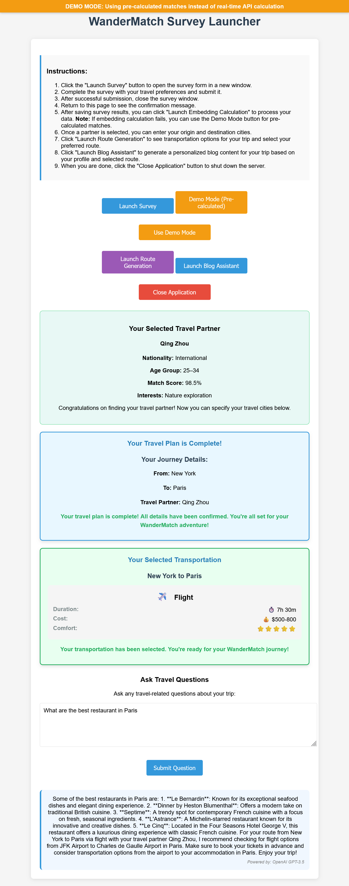

# WanderMatch

WanderMatch is an application that helps users find compatible travel companions, generate personalized itineraries, and create travel blogs based on user preferences.

## Demo



## New React Deployment

This project now includes a React-based web deployment for public use. To start the application:

```bash
# Run the launcher script from the root directory
python serve_survey.py
```

This will:
1. Verify that your environment has all the necessary dependencies
2. Check for the correct directory structure
3. Start both the backend API and frontend React app
4. Open the application in your browser

## Prerequisites

- **Python 3.12+** with Flask, Flask-CORS, pandas, and requests packages
- **Node.js 14+** installed and added to your PATH environment variable
- npm (comes with Node.js installation)

## Original Features

- **User Profile Creation**: Collect travel preferences and personal information through an interactive survey
- **Partner Matching**: Match users with compatible travel companions using AI-powered similarity analysis
- **Transport Comparison**: Compare different transportation options (flight, train, bus, car) with detailed information on duration, cost, carbon footprint, comfort level, and pros/cons
- **Interactive Maps**: Visualize travel routes with interactive Folium maps showing attractions and travel paths
- **Blog Generation**: Automatically create travel blogs using AI (Gemini or OpenAI) with personalized content based on user profile and travel details
- **Itinerary Planning**: Generate customized travel plans with attractions, route points, and timelines
- **Travel Q&A**: Ask travel-related questions and get AI-powered answers about your chosen destinations and routes

## Installation

> **Note**: This application requires Python 3.12+. Please ensure you have this version installed before proceeding.

1. Clone this repository:
   ```
   git clone https://github.com/yourusername/WanderMatch.git
   cd WanderMatch
   ```

2. Install dependencies:
   ```
   pip install -r requirements.txt
   ```

   The core dependencies needed for embedding calculation and web features are:
   - flask
   - flask-cors
   - pandas
   - python-dotenv
   - openai
   - numpy

3. Set up API keys in a `.env` file:
   ```
   OPENAI_API_KEY=your_openai_api_key
   GEMINI_API_KEY=your_gemini_api_key
   GOOGLE_API_KEY=your_google_maps_api_key (optional)
   ```

   **Important**: The OpenAI API key is required for embedding calculation and partner matching.

4. Ensure required directories exist:
   ```
   mkdir -p UserInfo_and_Match/survey_results
   mkdir -p get_user_info/backend
   mkdir -p wandermatch_output/maps
   mkdir -p wandermatch_output/blogs
   ```

## Original Usage

1. Start the original command-line application:
   ```
   python serve_survey.py
   ```

2. Complete the online survey:
   - Navigate to http://localhost:5000 in your browser
   - Fill out your travel preferences and personal information
   - Submit the form to create your profile

3. Select a travel companion or choose to travel solo

4. Enter your origin and destination cities

5. Compare transportation options:
   - View an interactive HTML comparison of different transport modes
   - See details about duration, cost, carbon footprint, and comfort
   - Select your preferred option

6. Review your generated travel route:
   - An interactive map will open in your browser
   - View the route, attractions, and key information
   
7. Explore your personalized travel blog:
   - Read a detailed travel narrative generated by AI
   - The blog adapts to your chosen destination, transport, and travel partner

## Web Deployment Usage

1. Run the launcher script:
   **Using the Web Survey Launcher**:
    ```
   python serve_survey.py
   ```
   The web survey launcher provides a user-friendly interface with:
   - A button to open the survey in a new window
   - Ability to run embedding calculations
   - Travel partner matching and selection
   - Note: Embedding calculation requires an OpenAI API key in the .env file

2. When the application opens in your browser:
   - Click the "Launch Survey" button
   - Fill out your travel preferences
   - Submit the form to save your data
   - You'll return to the home page with a "Calculate Travel Match" button

## Troubleshooting

### Network and CORS Issues

If you encounter errors related to NetworkError or CORS:

1. **Check the browser console** for detailed error messages
2. **Verify API URLs**: Ensure the frontend is correctly connecting to the backend
3. **CORS Configuration**: The backend has built-in CORS support but may need adjustments for custom domains
4. **Test Connection**: Use the `/api/health` or `/api/cors-test` endpoints to diagnose connection issues

### Blog Generation Issues

If blog generation fails:

1. **Check API keys**: Both OpenAI and Gemini keys should be valid
2. **Verify module imports**: Ensure blog_generator.py is accessible to the backend
3. **Check file permissions**: The output directory needs write permissions
4. **Examine server logs**: Detailed error information is logged on the server side
5. **Network connectivity**: Ensure the frontend can reach the backend API

### Node.js and npm Issues

If you encounter errors related to Node.js or npm:

1. **Verify Node.js Installation**
   - Ensure Node.js is installed by running: `node --version`
   - If not installed, download it from https://nodejs.org/
   - Ensure you install the LTS (Long Term Support) version

2. **Path Issues**
   - Make sure Node.js is in your PATH environment variable
   - On Windows, the installer should add it automatically
   - You may need to restart your terminal or computer after installation

3. **npm Not Found**
   - npm comes with Node.js installation but might not be in the PATH
   - On Windows, check if npm.cmd exists in the same folder as node.exe
   - Try reinstalling Node.js if npm is missing

4. **Permission Issues**
   - On Linux/Mac, you might need to run commands with sudo
   - On Windows, try running your terminal as administrator

5. **Manual Installation Verification**
   - Our verification script can help diagnose issues:
   ```
   cd deploy
   python verify_setup.py
   ```

### Other Common Issues

- **Survey data not saving**
   - Check the console output for the path where data is being saved
   - Ensure the directory exists and is writable
   - The backend tries to save to the original location at `../../UserInfo_and_Match/survey_results`

- **API connection issues**: Verify API keys and internet connectivity
- **Map display problems**: Ensure Folium is properly installed and browser access is available
- **Transport API failures**: The system will automatically use default transport options

## Project Structure

```
WanderMatch/
├── serve_survey.py           # Main application entry point
├── get_user_info/            # User survey and information collection
├── UserInfo_and_Match/       # Profile management and matching algorithm
├── map_utils.py              # Map generation with Folium
├── transport.py              # Transportation options comparison
├── route_generator.py        # Travel route planning
├── blog_generator.py         # AI-powered travel blog creation
├── ui_utils.py               # Terminal UI utilities
├── deploy/                   # React web deployment
│   ├── backend/              # Flask API backend
│   └── frontend/             # React frontend
├── requirements.txt          # Project dependencies
└── wandermatch_output/       # Generated maps, blogs, and visualizations
```

## Transportation Features

The transportation system provides:
- AI-generated transport options using Gemini and OpenAI
- Fallback to default options when APIs are unavailable
- Detailed comparison of transport modes (flight, train, bus, car)
- Interactive HTML visualization with responsive cards
- Color-coded carbon footprint indicators
- Text-based terminal interface with standardized formatting

## Map Visualization

The map generation system offers:
- Interactive Folium maps of travel routes
- Markers for origin, destination, and attractions
- Popup information for key locations
- Clustering of nearby attractions
- Color-coded route lines based on transport mode
- Support for multiple geocoding services

## Blog Generation

The blog creation system features:
- AI-powered blog generation using Gemini or OpenAI
- Templated blog generation as a fallback
- Personalization based on user profile and travel details
- Markdown formatting with structured sections
- Conversion to HTML with styled presentation
- Automatic browser opening to display blogs
- Enhanced error handling with detailed diagnostics
- Cross-origin request support for deployed environments

## Travel Q&A Feature

The travel question answering system provides:
- Context-aware answers based on your selected route and partner
- Integration with multiple LLM providers (OpenAI GPT-3.5, Google Gemini)
- Automatic fallback mechanisms if one service is unavailable
- Elegant UI that displays the source of information
- Seamless integration with the rest of your travel planning process

## Deployment Options

### Local Deployment

Follow the installation and usage instructions above to run the application locally.

### Render Cloud Deployment

WanderMatch is optimized for deployment on Render's cloud platform:

1. **Blueprint-based Deployment**: Using the included `render.yaml` file
2. **Multi-service Architecture**:
   - Backend API service with Python Flask
   - Frontend static site for a responsive UI
3. **Automated Configuration**: Environment variables, CORS settings, and service connectivity

For detailed deployment instructions, see [RENDER_DEPLOYMENT.md](RENDER_DEPLOYMENT.md)

## Requirements

- Python 3.12.9 (required)
- OpenAI API key
- Gemini API key
- Google Maps API key (optional, for enhanced geocoding)
- Required packages listed in requirements.txt

## Terminal Output

The application uses straightforward terminal-based output with clear text formatting:
- All console messages use standard print functions with text-based indicators
- Status messages are prefixed with indicators like [INFO], [SUCCESS], [WARNING], etc.
- Tabular data is formatted with basic text alignment
- The system works consistently across all terminal types without special formatting requirements

## Fallback Mechanisms

The application implements robust fallback mechanisms:
- Server-side storage with proper error handling and reporting
- Multiple encoding attempts for CSV files to prevent Unicode errors
- Directory path validation with alternative paths if standard paths are unavailable
- Cascading API services (Gemini → OpenAI → templates)
- Default transport options when API services are unavailable
- Multiple geocoding service options if the primary service fails

## Updates

### Recent Changes
- **Python Version Requirement**: Updated to require Python 3.12.9
- **Terminal Output Simplification**: Removed rich package dependency for better compatibility across different terminals
- **CSV Storage**: Improved server-side storage of survey responses with enhanced error handling
- **Configuration**: Added pyproject.toml for modern Python packaging

## License

This project is licensed under the MIT License - see the LICENSE file for details.

## OpenAI API Quota Management

### Current Issue

The application uses OpenAI's embedding model to calculate similarity between survey responses. If you encounter an error like:

```
Error running embedding calculation: Server responded with status: 429
```

This means the API key has reached its usage limit. OpenAI imposes rate limits and quota limits on API keys.

### Solutions

1. **Use a different API key**: Update the `.env` file with a new API key.

2. **Use the demo mode**: The application now has a fallback demo mode that uses pre-calculated matches when the API quota is exceeded. You'll be prompted to enable this mode when an API quota error occurs.

3. **Wait and try again later**: Quotas often reset after a certain period (typically monthly).

4. **Increase your OpenAI API usage tier**: Visit the [OpenAI billing page](https://platform.openai.com/account/billing/overview) to increase your usage limits.

### For Developers

If you're extending this application, consider implementing:

- Local caching of embeddings (already implemented)
- Batch processing to optimize API calls
- Alternative embedding models, like those from Hugging Face that can run locally
- Fallback mechanisms for when the API is unavailable